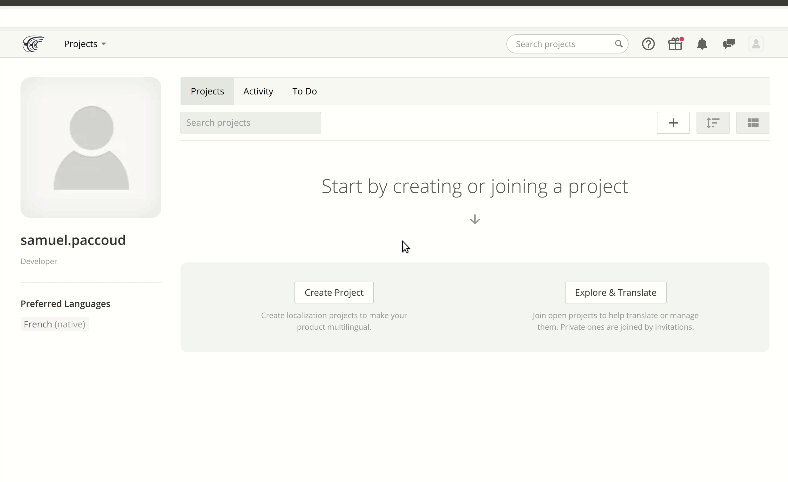

`richie` has built-in localization and internationalization:

- On the backend and CMS, i18n is built on the shoulders of Django and DjangoCMS,
- On the frontend, we use React Intl.

## Contributing as a translator or proof-reader

We use the [Crowdin](https://crowdin.com) web platform to translate Richie to different languages.
All translations are hosted at https://i18n.richie.education, which allows translators and
proof-readers to contribute on translations in the languages they master.

### Sign-up on Crowdin

If you don't have an account on Crowdin already, go to https://accounts.crowdin.com/register and
fill out the form to create a free account.

### Join the Richie project

Now that you have an account on Crowdin,
[look for the project called "Richie"](https://crowdin.com/project/richie), select the language
on which you wish to contribute and click the "Join" button as demonstrated below:

We will then review you application and you should soon start translating strings!

For more information on how Crowdin works, you can refer to
[their documentation](https://support.crowdin.com).

### Add a new language

If Richie is not yet translated in the language you want, let us know by clicking the "contact"
link on [Richie's Crowdin profile page](https://i18n.richie.education) and we will consider adding
it.

If you request a new language, the Richie community will expect you to keep this language
up-to-date each time strings are modified or new strings are added, and this before each
release.

Before asking for a new language, make sure it does not already exist. If your language already
exists in another variant (e.g. Brazilian portuguese vs Portugal portuguese), you may consider
contributing on the existing language if your resources to contribute are limited.
