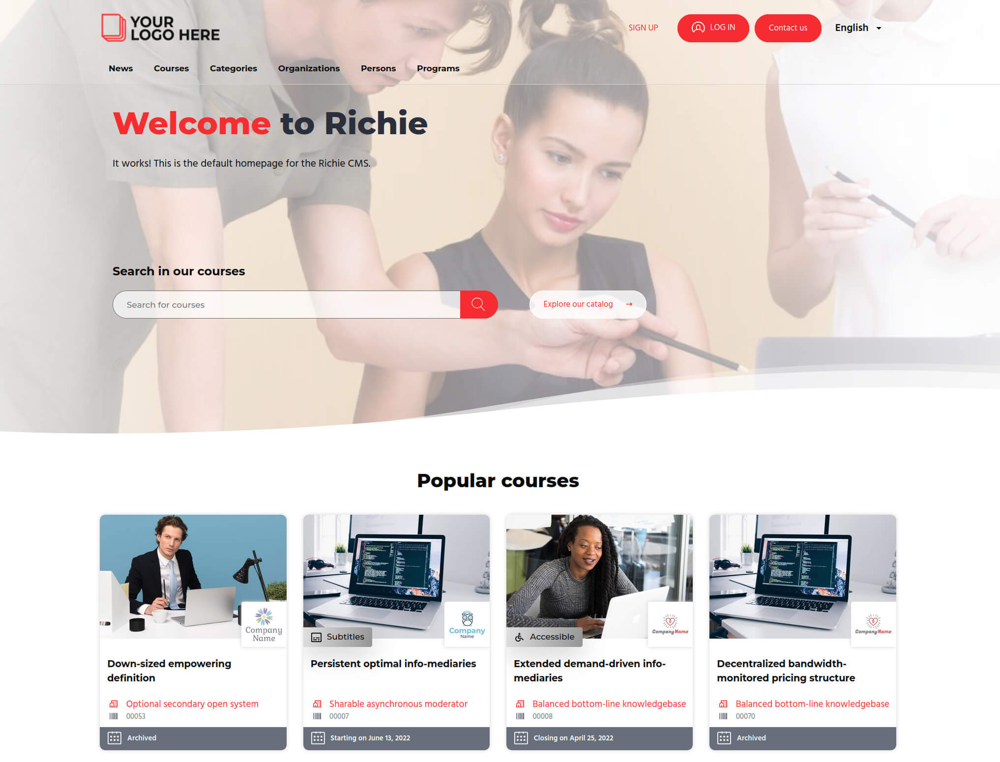

`Learning Management Systems` (LMS) are great tools for hosting and playing interactive online
courses and MOOCs.

However, if you need to build a complete website with flexible content to aggregate your courses,
in several languages and from different sources, **you will soon need a CMS**.

At "France Université Numérique", we wanted to build an OpenSource portal with `Python` and
`Django`. That's why we built `Richie` on top of [DjangoCMS](https://www.django-cms.org), one of
the best CMS on the market, as a toolbox to easily create full fledged websites with a catalog of
online courses.

Among the features that `Richie` offers out of the box:

- multi-lingual by default,
- advanced access rights and moderation,
- catalog of courses synchronized with one or more `LMS` instances,
- search engine based on `Elasticsearch` and pre-configured to offer full-text queries,
  multi-facetting, auto-complete,...
- flexible custom pages for courses, organizations, categories, teachers, blog posts,
  programs (and their inter-relations),
- Extensible with any third-party `DjangoCMS` plugin or any third-party `Django` application.

## Quick preview

If you're looking for a quick preview of `Richie`, you can take a look and have a tour of
`Richie` on our dedicated [demo site](https://demo.richie.education).

It is connected back-to-back with a demo of OpenEdX running on
[OpenEdX Docker](https://github.com/openfun/openedx-docker).

Two users are available for testing:

- admin: `admin@example.com`/`admin`
- student: `edx@example.com`/`edx`

The database is regularly flushed.

## Start your own site

The next step after discovering Richie on the demo is to start your own project. We provide a
production-ready template based on [Cookiecutter](https://github.com/audreyr/cookiecutter) that
allows you to generate your project in seconds.

Follow the guide on [starting your own Richie site with Cookiecutter](./cookiecutter.md).

Once you created a new site, you will be able to fully customize it:

- override any Django template or portion of template,
- [override ReactJS components](./frontend-overrides.md),
- override some css rules or rebuild the whole css with your own variables and customizations,
- add any [DjangoCMS](https://www.django-cms.org) plugin or feature,
- add any [Django third-party application](https://djangopackages.org).
